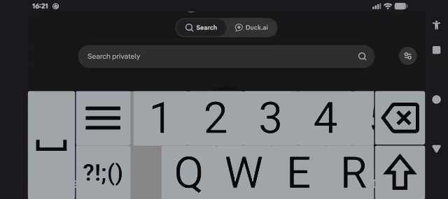

# BroadBoard

BroadBoard is an on-screen keyboard (IME) designed for people with low vision. Instead of shrinking keys to fit everything on the screen at once, BroadBoard keeps every key big and readable — you simply pan around the keyboard to reach the keys you need, so no key ever has to be small.

[](LICENSE)
[](https://play.google.com/store/apps/details?id=com.galagidae.broadboard)



## Features

- Large, scrollable keyboard with oversized, high-contrast keys
- Multiple color themes, including extra dark and high-visibility options
- Adjustable keyboard sizes, up to extra large
- Optional haptic feedback
- Screen reader friendly
- Locale support
  - English (United Kingdom)
  - English (United States)
  - Greek
  - Italian
  - Portuguese (Brazil)
  - Portuguese (Portugal)
  - Russian
  - Spanish (Latin American)
  - Spanish (Spain)
  - More to come

## Installation

### Google Play

<a href="https://play.google.com/store/apps/details?id=com.galagidae.broadboard">
  
</a>

## Setting up the keyboard

After installing, BroadBoard must be enabled and selected as your input method:

1. Go to **Settings → System → Languages & input → On-screen keyboard → Manage keyboards**
2. Enable **BroadBoard**
3. Switch to it via the keyboard picker (tap the keyboard icon in the navigation bar, or long-press the spacebar in most apps).

Alternatively, launching BroadBoard from the app tray provides guided links to the correct settings screen and keyboard picker

## Building from source

This project is built with the Gradle command-line tools (no Android Studio required).

```bash
git clone https://github.com/galagidae/broadboard.git
cd broadboard

# Debug build
./build.sh

# Release build
./build.sh release
```

Requirements:

- JDK 17
- Android SDK with platform 36 and build-tools 36 installed (`sdkmanager` is sufficient – Android Studio is not needed)

## Privacy

BroadBoard collects no data.

See [PRIVACY.md](PRIVACY.md) for details.

## License

This project is licensed under the **GNU General Public License v3.0**.

```
Copyright (C) 2026 Anthony Benbrook

This program is free software: you can redistribute it and/or modify
it under the terms of the GNU General Public License as published by
the Free Software Foundation, either version 3 of the License, or
(at your option) any later version.
```

See [LICENSE](LICENSE) for the full text.
